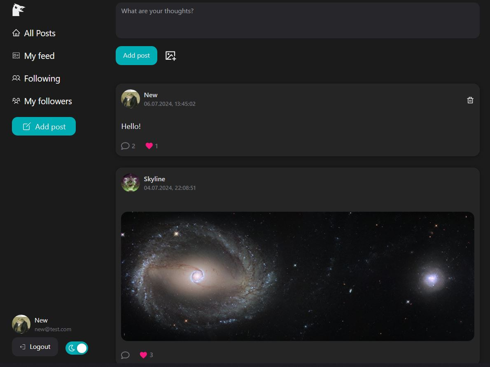

# Chirickter

### **Description**

Fullstack application inspired by X/Twitter. Allows users to create tweet-like posts, leave likes and comments on posts as well as follow other users.

#### 🔗 [Live preview](https://chirickter.vercel.app/)



### **Features**

- JWT authorization
- Edit your profile info, upload an avatar
- Create/delete post, attach an image
- Leave a like or comment on post
- Follow feature: see people you are following and your followers
- Feed feature: see posts of users you are following
- Dark theme switch

### **Built With**

- **Frontend**
  - React
  - Redux Toolkit
  - React Router
  - React Hook Form
  - TypeScript
  - Tailwind
  - Next UI
  - Vite
- **Backend**
  - Express
  - Prisma (MongoDB)
  - JWT
  - Multer
  - Bcrypt
  - Docker

### Installing and running

1. Clone this repo

```bash
git clone https://github.com/Dimar1510/social.git
```

2. Rename client .env.local file to .env

```bash
mv social/client/.env.local social/client/.env
```

3. Navigate to the server folder

```bash
cd social/server
```

4. Rename server .env.local file to .env (in case you want to change database URL or compose project name)

```bash
mv .env.local .env
```

5. Launch the docker compose

```bash
docker compose up
```

6. The project will be available on _http://localhost:80_
